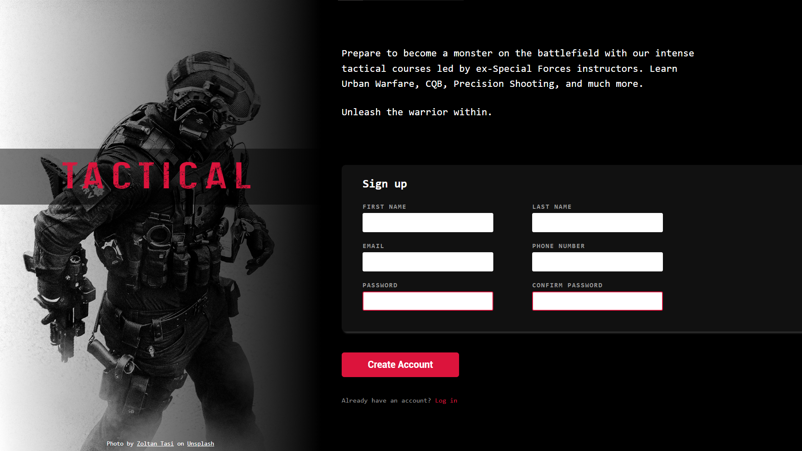

# 🎖️ **Tactical — Military Training Sign-Up Page**

  
The Tactical Sign-Up Page is a themed military recruitment-style interface created during my web development studies in The Odin Project.
It was designed from scratch using HTML and CSS, focusing on layout structure and form design.

---
## 🕹️ **Live Demo**

👉 [Click here](https://italoalulas.github.io/sign_up_form/)

---
## ⚙️ **Features**

- 🎖️ Military-inspired visual theme and typography.
- 📋 Custom sign-up form with structured input fields.
- 🎯 Clear visual hierarchy using spacing, color, and layout.
